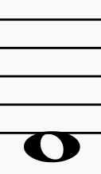
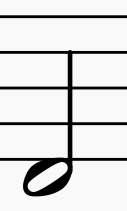
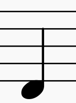
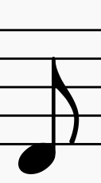

## Notedurations

`musiclib/types/notedurations.py`

This types contains typical music note durations. Whole note is equivalent of 1.0 float number. Wherever you can provide note duration you can use this enum or just float number.

### Values

| Enum                            | Note                                  | Value   |
| ------------------------------- | ------------------------------------- | ------- |
| NoteDurations.WHOLE_NOTE        |          | 1.0     |
| NoteDurations.HALF_NOTE         |           | 0.5     |
| NoteDurations.QUARTER_NOTE      |        | 0.25    |
| NoteDurations.EIGHTH_NOTE       |          | 0.125   |
| NoteDurations.SIXTEENTH_NOTE    |      | 0.0625  |
| NoteDurations.THIRTYSECOND_NOTE |  | 0.03125 |

### Methods

#### getIntervalsSemitone

```py
@staticmethod
def getNoteDurationsFromFloat(x):
```

Static method that returns note duration that match given float or null if float doesn't match any enum;

```py
from musiclib import Intervals

Intervals.getIntervalBySemitones(3)
```
